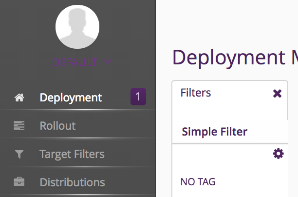
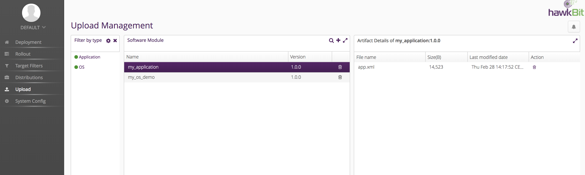
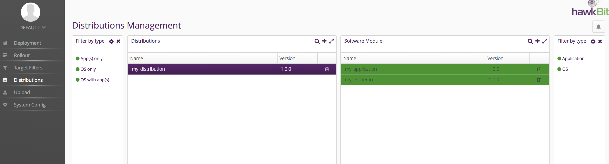
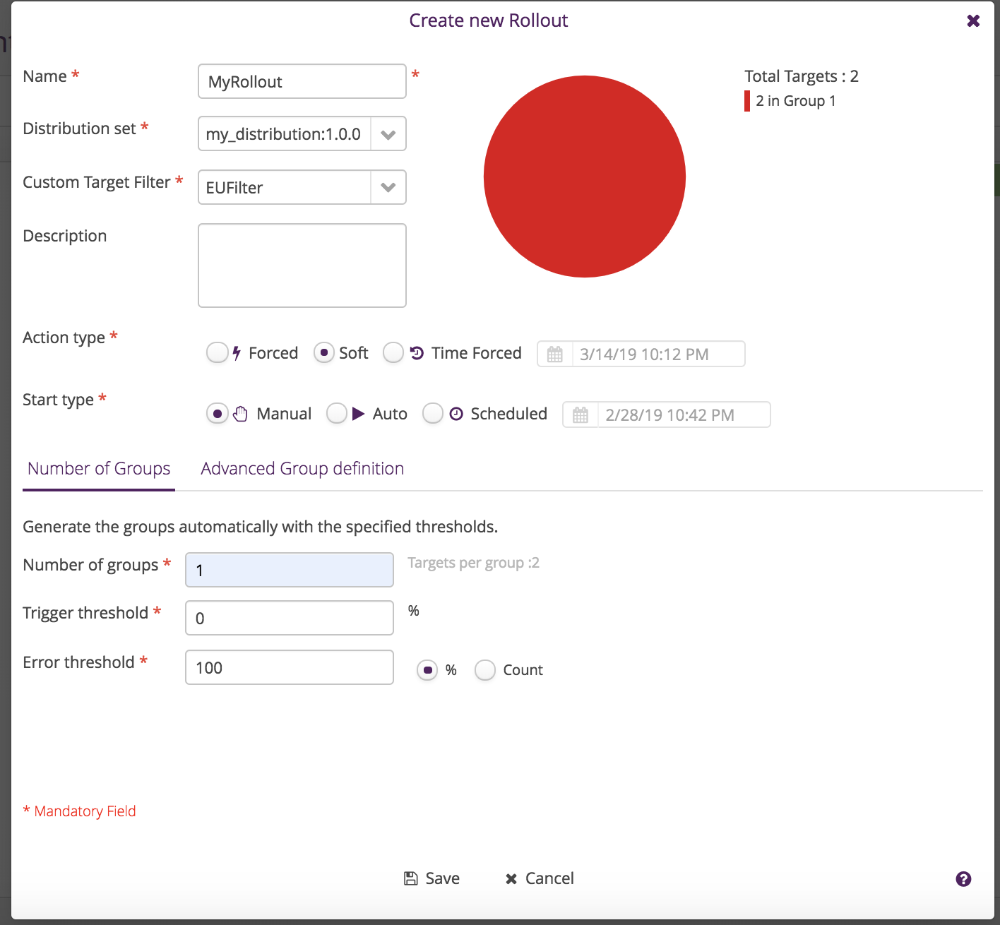
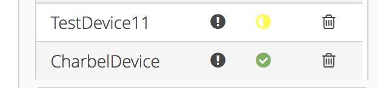

# hawkBit-HowTo

# Connect to HawkBit Server

First login to your VM instance: **http://YOURHOST:8080/UI**
HTTPS is not yet supported

## Device population from GCP 

The HawkBit GCP integration module relies on pub sub notifications when devices are added/removed to populate/remove the devices from the GCP registry. The population process usually takes 45 seconds interval.

Your device will appear in the **Deployment** tab of the UI.

## Device Deletion

If you deleted your device by mistake from HawkBit, it will not be deleted from the GCP IoT Core registry.
In order to force HawkBit to re-populate your device, invoke the following http hook: **YOURHOST:8083/gcp**

Your will get a notification on the deployment widget when they appear, as shown in the image below.



# Tagging your devices
When your device appears you can start tagging it by two means:
- Create a list of tags on the left of the **Deployment** tab of the UI.
- Selecting a device and then looking for the tags widget as shown in the image below 


> TODO:
```
Create one tag and then associate it to your device(s).
```

# Creating a Software Module

Click on the **Upload** tab on the left.

A Software Module in HawkBit is of two types:
- Operating System
- Application

It is composed of one or many artifacts. An **artifact** is a file of any type. During a firmware rollout, HawkBit does not differentiate between them. Each file will be uploaded to the HawkBit Server.

> TODO:
```
Create two software modules an OS and an App and upload their files (for now upload a json of xml)
```

The following image shows an example of two software modules, an OS and an App.


# Create a Software Distribution

Click on **Distributions** on the left tab.

A distribution can be of three types:
- OS with app(s)
- OS only
- App only

The association between the distribution and the software modules happens by drag and drop

> TODO:
```
Create software distribution and associate the software modules to it by drag and drop
Make sure your modules turn to green when you select the software distribution
```

The following image shows an example of a distribution module composed of an OS and an App modules.


# Create a Target filter

Target filters can be created on any information from the device. For now, we will use the tags.
Create a new target filter and below the filter name type:
```
tag==YOUR_TAG_HERE
```

Then give a name to your target filter.

> TODO:
```
Create a Target filter and save it
```

# Create a rollout
A rollout is a combination of the following:
- Software Distribution
- Target Filter
- Rollout Configuration

For now select the following configuration as shown in the image below where:
- Error threshold 0
- Trigger threshold 100

To know more about these configuration visit the HawkBit [documentation](https://www.eclipse.org/hawkbit/concepts/rollout-management/) and the[ManagementUI](https://www.eclipse.org/hawkbit/ui/)



> TODO:
```
Create a rollout
```

# Use the device simulator 
The device simulator will allow to accept the download and install the file and run it.
During each of these steps, the device is expected to communicate its status with the HawkBit GCP Module.
To use the device simulator, please download it from [here](https://github.com/ionia-corporation/gcp-iot-simulator)

When you completed the download and install of the rollout, the succesful devices will have a green check mark as shown below:




# In case of errors

Follow these steps:
- delete your device from HawkBit
- run YOURHOST:8083/gcp to reimport it
- Tag your device
- Create a new Software Distribution
- Create a new Rollout

# TODO
- Import device metadata from IoT Core GCP to HawkBit
- Dockerizing the GCP HawkBit module
- HTTPs support
- Other lifecycle management such as revert & cancel download

# To reRun the GCP Module

To restart the GCP module:

- SSH to your VM Instance

- Kill the java process
```sh
ps -e | grep java
```

- Then run the runGCP_HawkBit.sh
```sh
./runGCP_HawkBit.sh
```
